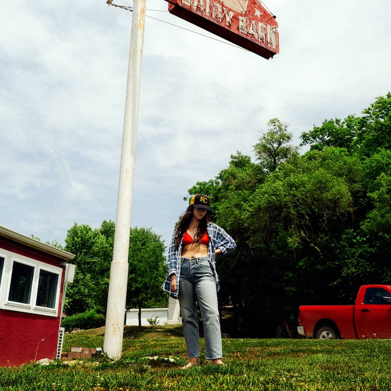

"Tiger's Blood" is a glorious bundle of songs that writhe with brains and heart, with love and friendship, and many other complements and opposites. The music is mostly alternative AOR with a distinct country twang. The lyrics were pretty impenetrable to me, at least until I looked them up online (and they're also on the back of the poster that came with the LP), but they're mostly songs of hope and happiness. It was satisfying to listen to an album this care-free, even if there is a hint of darker times in the background. 

Lots of the songs on "Tiger's Blood" are about moving on from the past. "3 Sisters" begins the album by questioning a relationship ("all my life / I've been running from what you want"). The title suggests it could be about sibling relationships, but it's written so you can read what you want into it. But there's also the same sense of turnabout on both "Evil Spawn" ("What you're holding so close calls you by name / What you thought was enough now seems insane") and "Ice Cold" ("If I'm losing touch with / Everything I once hеld / I wouldn't think much of it").

And those songs that aren't about change are about a sense of security in oneself, which is a rare topic for songs. The biggest from the album as been "Right Back To It" and it's easy to understand why, everything about it radiates happiness and contentment ("you just settle in / Like a song with no end / If I can keep up / We'll get right back to it"). I'm not sure I would have liked this song so much if I weren't married, but that's perhaps I hadn't got that much into a groove with a partner until I found the person I wanted to marry. (TMI! Sorry!)

In a similar vein you have "Burns Out At Midnight" which has an argument fading out late in the evening and "Lone Star Lake" in which a becalmed relationship is gently nudged along with lazy days in bed and trips out to the lake. (Ear Worm Alert: I find "Lone Star Lake" to be incredibly catchy and can walk around singing it for quite a while...)

There are also some beautiful bittersweet songs including "Crimes of the Heart" which picks apart an ex's narcissism ("You play the villain like a violin / It comes from within"), and "The Wolves" which seems to be about coming to terms with being in the public eye, although the line about the lock on the door  ("There's a lock on the door that costs more than my car, babe") has pretty strong resonance of a curdled relationship. Tellingly, the last line is "not begging for a key".

The title track which ends the album is gloriously spooky and another earworm that has gradually worked its way into me over the year. The chorus vocals at the end of the song are really moving. I haven't really said a lot about the arrangements, they're mostly unfussy and out of the way, you only notice them from time to time, like the lovely banjo line in "Right Back To It" that ripples off under the vocal. There's just so much great playing by the musicians on this album, they're probably having a field day because these are such great songs.

Fun fact: Tiger's Blood is a shaved ice dessert made with a red syrup usually made from watermelon and strawberry ("your teeth and your tongue bright red from tiger's blood").

### Other options

Because I've loved so many albums this year, after each review I am going to include a couple of pointers to additional albums that you might enjoy if you like the album in the main review. This is not me showing off (well, not much), but rather giving credit to the many excellent albums released this year!

#### MJ Lenderman, Manning Fireworks

MJ Lenderman sings a lot of the additional vocals on Waxahatchee's "Tiger's Blood" and this piqued my curiosity about his own songs. They're really interesting, quite sad and deadbeat, but also often very funny. I have no idea why (actually it might be the video) but "She's Leaving You" is one of my favourite songs of the year. 

#### Fontaines DC, Romance

I think their previous effort "Skinty Fia" is a better album, but "Romance" has definitely grown on me. It has some really immediate songs on it like "Starburster", "Bug", and "Favourite". But there are also some great slow burners too like "Horseness is the Whatness", "In The Modern World", and "Motorcycle Boy".

Their appearance at Glastonbury was so electrifying that I forced Ingrid to watch their Leeds Festival performance on iPlayer a few weeks later. It wasn't as good, but their charisma and starpower is utterly evident. Best of all, they won't be supporting or kowtowing to Oasis on their zombie resurrection in 2025 because Liam Gallagher hates them. What better endorsement could there be?