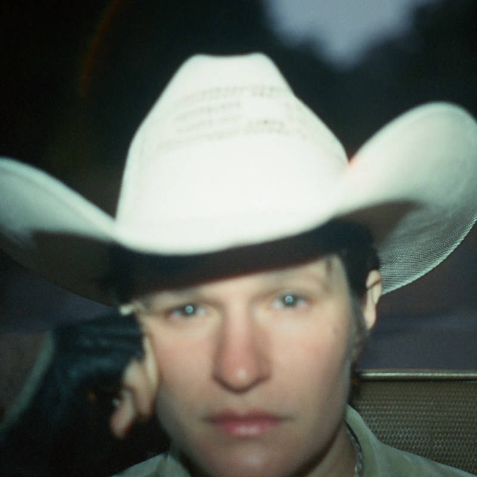

One album that's lurking in the periphery of my [understated classics series]() is "Dragon New Warm Mountain I Believe In You" by Big Thief. "Bright Future" is the latest solo album by Big Thief singer-songwriter Adrianne Lenker and it is just as good. Intimate and intricate, it draws the listener in as Adrianne sings live with a very small band. At times you can hear breaths drawn and the sound feels like a small space that you are cocooned in: this could be sound engineering (spatial audio would have us believe anything is possible) but it's most likely equipment set up intelligently in a cosy studio.

And what songs! Straight of the gate "Real House" is an absolutely breathtaking song on the 100th listen let alone the first. Spanning many years it tells the story of Adrianne growing up and observing the reactions of her mother to various events, including the heartbreaking death of the family dog. It's a genuine song, something that I'd not really heard for ages. Even if it's not autobiographical, it's completely believable

Next up, "Sadness As A Gift" reiterates the same ethos of kindness and warmth, this time more focussed on a friendship or a relationship. "Fool" is a lovely lilt of a song that lists news from friends, all while pleading for a lover to pay some attention. "No Machine" has a campfire vibe, with mentions of dragonflies and wind on your back, building into a lovely lullaby of professed love. 

The other great song on album is "Free Treasure" with its celebration of all things pastoral and familial, the "understanding, patience and pleasure, time and attention, love without measure" are the world's best gifts: the free treasure of the title. On the first run through the chorus, she has a little laugh as though responding to one of her co-players, it's a lovely little moment.

"Vampire Empire", already recorded live with Big Thief, gets a pretty spiky rendition here. It's the most downbeat song on the album but even with its frustrated impatience with an errant lover, it still makes a strong cry for being independent and demanding that a lover does better. I enjoy this song, but it does feel like it exists in contrast with the band's version. 

The second half is quite playful and experiment. "Evol" plays with palindromic sentences: "love spells evol / backwards people" and apparently looks like an e.e. cummings poem when printed out in the album artwork (TODO: Buy a copy of this on vinyl). "Candleflame" seems to be an attempt to write the cutest song ever about a power cut. "Cell Phone Says" surprises with its references to mobile phones, though its telling that there's no doom scrolling here - just that awkward moment when you realise who is calling you. 

The album closes out with "Ruined", a song that is far sweeter than its title. 

In the summer, I went to collect Ingrid from the theatre where she'd been seeing a play with friend. It was a long play and I completely misjudged when I had to meet her. I ended up getting there an hour early. I ended up sitting in the lobby for the whole time just listening to this beautiful album. The time flew by, it was almost like free treasure.

### Other options

Because I've loved so many albums this year, after each review I am going to include a couple of pointers to additional albums that you might enjoy if you like the album in the main review. This is not me showing off (well, not much), but rather giving credit to the many excellent albums released this year!

#### Iron & Wine, Light Verse

My enthusiasm for Iron & Wine waned after a horrible gig at the Camden Roundhouse and the rather mediocre "Kiss Each Other Clean" album. I've been vaguely aware of various reboots, reissues, and other course corrections over the years but nothing that really made me want to listen to Sam Beam's music again.

"Light Verse" - the seventh Iron & Wine album - is the first I've listened to in full for quite a while. Sure, there are a few of the old excesses there to bore you (looking at you "Tears That Don't Matter") but overall it's a solid set of songs. In particular the first half with "Anyone's Game" (perhaps a candidate for one of his best ever songs) and the wry, funny Fiona Apple collab "All in Good Time".

#### Kim Deal, Nobody Loves You More

This debut album from Kim Deal the legendary Pixies bassist came along a bit late in the year to make the Top 10. Maybe it'll make next year's list. (Spoiler alert: one album on 2024's list was released later in 2023 than this album was in 2024 so who knows?!)

Anyway, these are great immediate songs that are sung from a deep well of experience. Whether with the Breeders or now under her own name for the first time, Kim makes sounding effortless sound so effortless, but if you listen closely there are all sorts of examples where she just casually drops a beautiful melody or an energetic scuzzy riff. Fabulous.