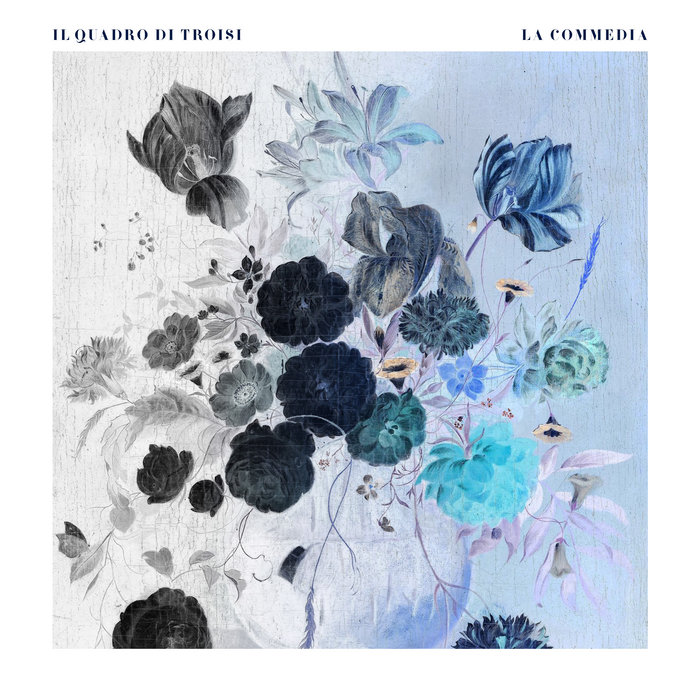

### Other options

Because I've loved so many albums this year, after each review I am going to include a couple of pointers to additional albums that you might enjoy if you like the album in the main review. This is not me showing off (well, not much), but rather giving credit to the many excellent albums released this year!