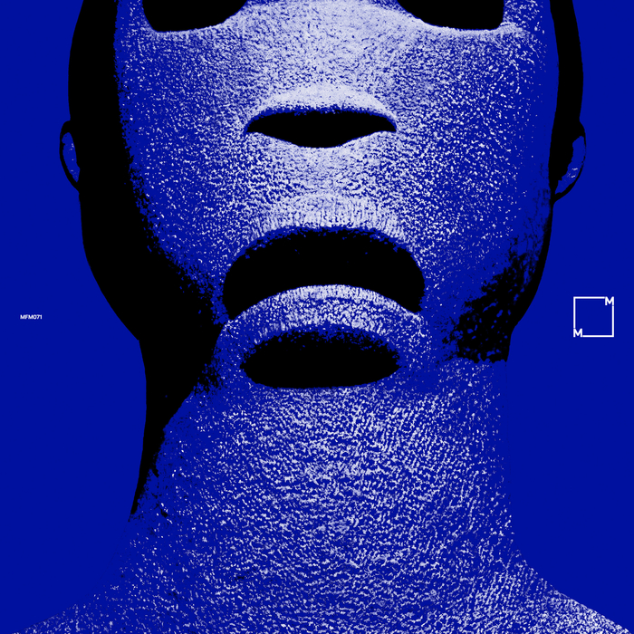

What do you think of when you think of the colour blue? The sea? Perhaps the sky? Maybe it makes you think of blue stones like sapphires, or flowers such as forget-me-nots? Maybe the colour blue is the glow of a phone screen on someone's face (maybe yours) in the dark? Blue gathers at the edges of the harsh white LED light that has come to dominate our night time existence.

Think again of a clear flowing stream and you'll be instantly transported to the sound world of "The Path", the first track on Total Blue's eponymous album. A mixture of soft jazz and delicate ambient electronics, it flows over and under itself, in layers that ripple and shimmer like a river in motion. If we are living in the future of virtual reality headsets, then "Total Blue" will make you realise that the technology was in our heads all along. the next track "Corsair" is evocative of so many things: different times and places, memories, all created and summoned into your head with just a few melodies and motifs.

This continues on "Heart of the World" and "Jaguarundi", the former with pulses that build up underneath ripples of airy synth and the latter a woozy soundtrack to a voyage to the centre of a jungle. The temples there all built in ancient stones, carvings of jaguars with inset eyes made from lapis lazuli, the walls and floors interrupted by the trees that overgrow the abandoned city. 

"Total Blue" emphasises the importance of music that generates imaginative responses in human brains. As we drift closer and closer to a world in which truth is completely blurred by generative AI content, the importance of thinking and imagining with your actual human brain has never been greater. It's also an ideal album for falling asleep to!

This album is released on a label called [Music From Memory](https://www.musicfrommemory.com), and as a result of my love for "Total Blue" I've now listened to several other really interesting collections of ambient and electronic music. For example the compilation ["Virtual Dreams II - Ambient Explorations In The House & Techno Age, Japan 1993-1999"](https://www.musicfrommemory.com/release/8986/various-artists/virtual-dreams-ii-ambient-explorations-in-the-house-techno-age-japan-1993-1999), which is right up my alley and one of my most listened to compilations this year. 

### Other options

Because I've loved so many albums this year, after each review I am going to include a couple of pointers to additional albums that you might enjoy if you like the album in the main review. This is not me showing off (well, not much), but rather giving credit to the many excellent albums released this year!

#### Sedibus, Seti

Another effort from Orb head honcho Alex Paterson and former Orb member Andy Falconer. The first side drifts through purgatory and paradise, sounding a little bit like offcuts from their previous album "The Heavens". Side two breaks the title track up into three parts. In the halcyon days of the Orb this would probably have been a single! It's nice and chilled out, good for getting off to sleep and also good for getting work done. All the usual Orb elements are in play and at points it sounds more like the classic Orb of "Adventures Beyond The Ultraworld" or ["U.F.Orb"](https://mattischrome.com/posts/understated-classics-13/).

#### Banco de Gaia, Trauma

This is mostly pretty upbeat ambient techno, though I mostly keep going back for the beautiful opening track "Mir". It's a lovely downtempo track full of ambient flute sounds, perfect for creating breathing space in a playlist. Elsewhere, the national anthem of Sealand is sampled at one point on "My Little Country", which is nice to hear in the kitchen at tea time.