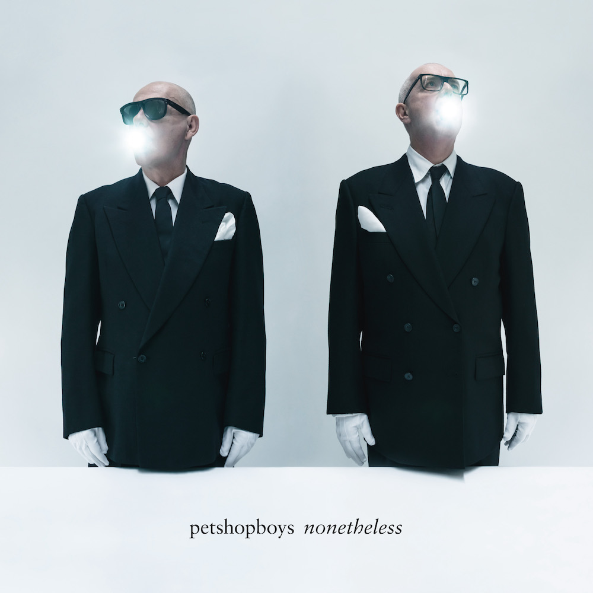

Nonetheless is the fifteenth album by the Pet Shop Boys. As seems to be a common theme with this top 10 so far, it's an album that initially underwhelmed me. Well, perhaps "underwhelmed" is a little unfair, it was more that it didn't seem to have much to it to distinguish it from their previous albums, and there have been some palpable duds in the previous fourteen.

Nonetheless, this album is definitely a grower. As I've gotten to know some of the songs, I've come to appreciate the little details strewn throughout. For example, the lovely little rave riff that breaks into the bridge on "Loneliness", something that turns a potentially stern song into something a lot more fun.

Better yet, PSB actually released singles - and *physical* singles at that - to periodically remind you that the album existed and take it off in new directions. Sometimes the video, like the simple and understated yet utterly romantic one for "Feel", managed to elevate my appreciation of the song. Elsewhere, a B-side jolted a recognition of the quality of the album tracks, such as the inclusion of a very old track like "I've got plans (involving you)" on the "A New Bohemia" single. Actually, speaking of that single, there's also a demo for "A New Bohemia" that unearths a whole new verse of the song.

There's already an expanded edition of "Nonetheless" that includes a couple of covers, a new original, and the whole album in demo form. My sister got it for me for Christmas but I haven't had a chance to listen to it yet (presumably the version of "A New Bohemia" is the same one that was on the single).

In July, we went to see the Pet Shop Boys perform their Dreamworld show at the Royal Opera House in London. It was fantastic. Three songs from Nonetheless were played that night and I think they held their own against the greatest hits, though there was probably a slight dip in people's attention during these songs. It was the performance of "Love Comes Quickly" where Neil inches slowly across the course of the song that made me quite emotional. It made me realise how powerful their best songs are. While the songs on "Nonetheless" don't have the same impact, they might do given time, and you could imagine that any of at least half the songs here could be swapped for others earlier in their career and have the same impact. 

### Other options

Because I've loved so many albums this year, after each review I am going to include a couple of pointers to additional albums that you might enjoy if you like the album in the main review. This is not me showing off (well, not much), but rather giving credit to the many excellent albums released this year!

#### Vampire Weekend, Only God Was Above Us

I enjoyed Vampire Weekend's last album so little that I drafted a really bad review of it for this blog. The experience was not fun and was probably what put paid to my album digest series. Thankfully after a five-year time-out "Only God Was Above Us" managed to course correct with a collection of straight-ahead solid songs that managed to both reference and build upon their previous work.

It's the noisiness and discordancy I like the most. At first listen, you can really hear the blasts and skronks of things going into the red or outside of the usual melodic lines. There are riffs that play on classic Vampire Weekend songs and there are weird musical interludes that feel like an unravelling. Elsewhere it's super chill and business as usual. Holding their own and breaking new ground, this is Vampire Weekend back to being themselves again. 

#### James, Yummy

Like the Pet Shop Boys, James have released a staggering number of albums, most of them good. Yummy is James' **18th** studio album: it didn't make my top ten because I don't think it hangs together that well, but there are some excellent songs. These include "Life's a Fucking Miracle" (or "Life's a Cracking Miracle" as the radio single would have it), "Shadow of a Giant" and "Rogue".  