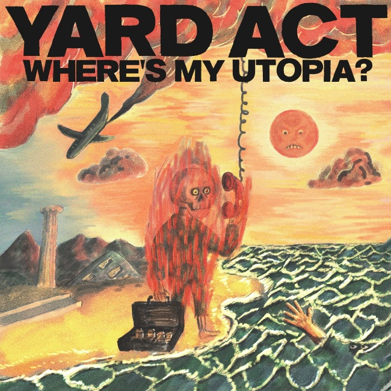

Yard Act are a post-punk band from Leeds. "Where's My Utopia?" is their second album. I first encountered Yard Act in a review of this album, which sent me to look at the excellent video to their non-album single "The Trenchcoat Museum". I enjoyed the metatextual references both in the video and the song, so I eagerly added "Where's My Utopia?" to my library.

However, the album took a while to win me over. Fourth-wall breaking asides and meta references are fine in a single song, even one as long as "The Trenchcoat Museum", but combined over the length of a whole album, it can be a bit off-putting. Nevertheless, WMU? rewards repeat listens (especially on headphones) because it's genuinely funny - I think comedy is an underrated quality in Indie music - and the songs themselves are ace.

The immediate standouts were "We Make Hits": an sardonic but also infectiously joyous origin story of the bad; "Dream Job": which samples Lionel Ritchie songs (I think?) and is super-catchy; and "When The Laughter Stops", a song that provides a bit of extra colour by featuring the vocal talents of Katy J Pearson all while being a welcome song about men's mental health. 

But as you continue to listen to it, you can hear loads of cross-cutting references across the songs, like repeated mentions of fizzy fish and the continual undermining of what's real versus what's invented. This culminates in the penultimate track "Blackpool Illuminations" which is a spoken word track that has singer James Smith psychoanalyse himself about an incident that may or may not have happened in his childhood. I'm usually wary of spoken word interludes on albums but here not only is the central conceit that lovely mixture of funny and heartwarming, but the music and arrangement underpinning the whole track gives it an extra life so that it's not just a single joke that can only be told once, but a track that plays a crucial role in the entire album's overall story.

I wonder why this album hasn't been praised more than it has. Perhaps the production and the difficulties in producing coherent excerpts make it harder to immediately love. But there is definitely something deeper and darker here that's worth exploring. Hopefully, it will continue to gain fans over the coming years. I know I will certainly be contributing to the word of mouth.

### Other options

Because I've loved so many albums this year, after each review I am going to include a couple of pointers to additional albums that you might enjoy if you like the album in the main review. This is not me showing off (well, not much), but rather giving credit to the many excellent albums released this year!

#### Elbow, Audio Vertigo
Another solid entry into the Elbow canon, with a good set of songs including "Lover's Leap" and "The Picture". Another great song was the non-album single, "Adrianna Again" which for its video borrowed that old New Order trick of having a different band mime to the song. 

#### W.H. Lung, Every Inch of Earth Pulsates
The third album from this band, who promised much with their Neu!-like early singles. "Every Inch of Earth Pulsates" finds them in a rockier space, having enlisted producer Ross Orton to capture some of their live sound. On the singles "How to Walk" and "The Painting of the Bay" it really works. Other tracks meander a bit, but that is always the more enjoyable aspect of this band. There is a still a strong sense of curiosity about what songs can be and what stories they can tell.