While off sick and under the weather I decided to play around with presenting the photos on this blog in a fashion more in keeping with the current Hugo theme.

I used [Imagemagick](https://imagemagick.org) to process the same files from [the Paris post](/posts/in-praise-of-paris/) earlier this week. I made them a bit smaller, reduced the number of colours to 256, posterized them (a built-in Imagemagick function that groups colours), and then did a dither on them.

```zsh
magick input.jpg -resize 800x600 -colors 256 -posterize 4 -ordered-dither o8x8 output.jpg
```

The results below are probably a bit too low quality, but they are smaller. It was fun to experiment with them.

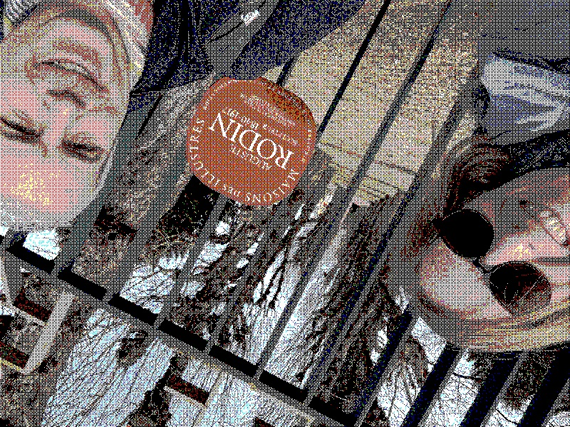
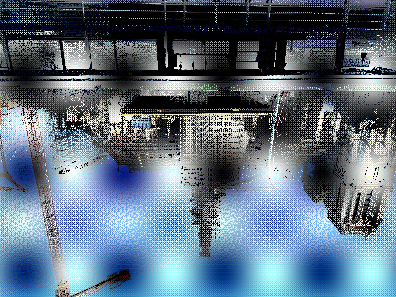
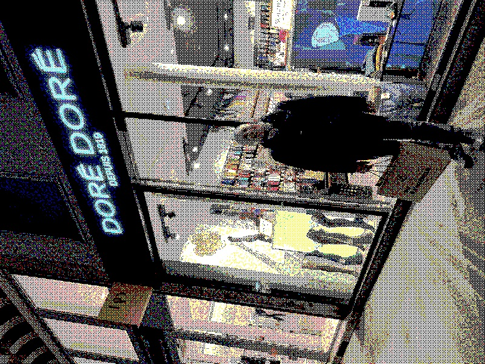
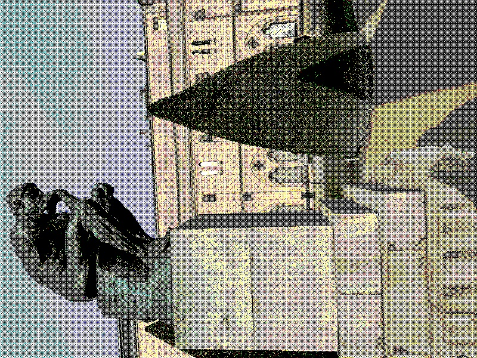
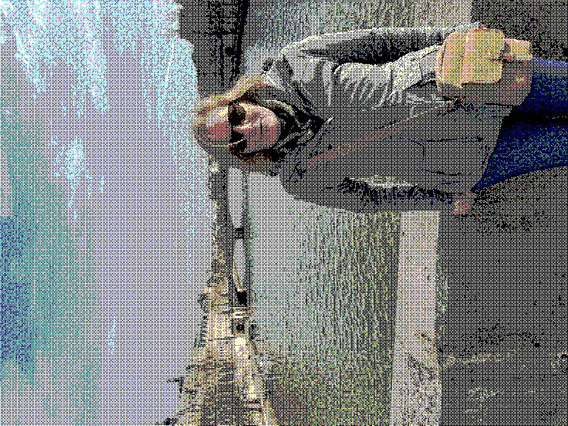
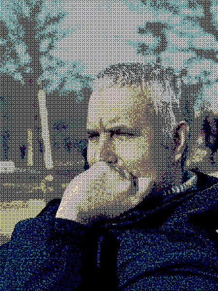
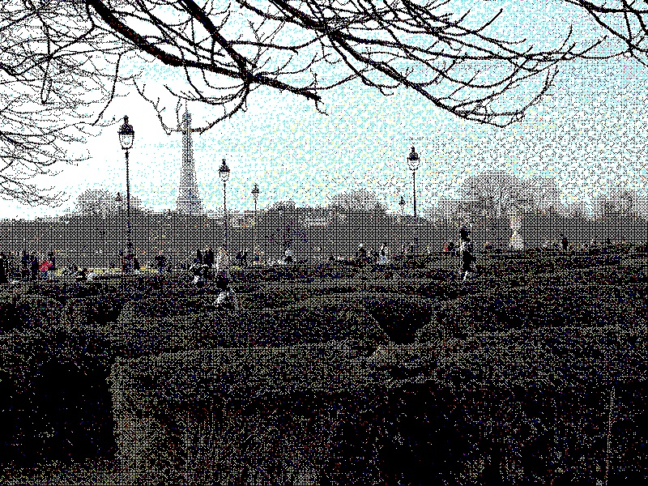
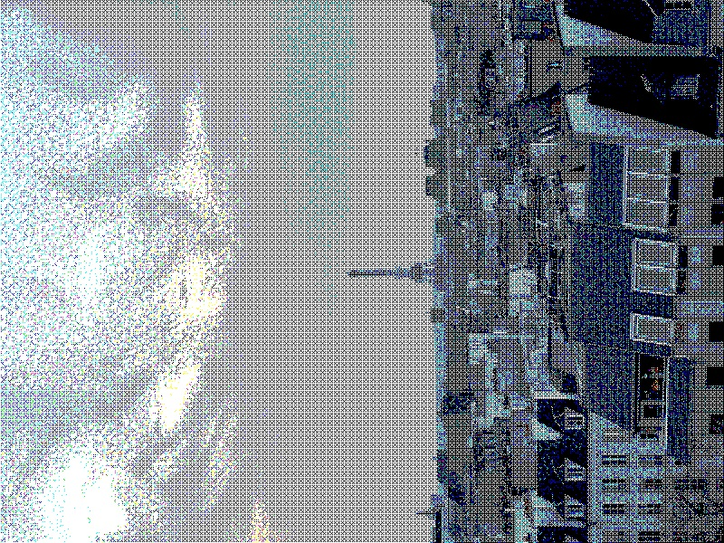
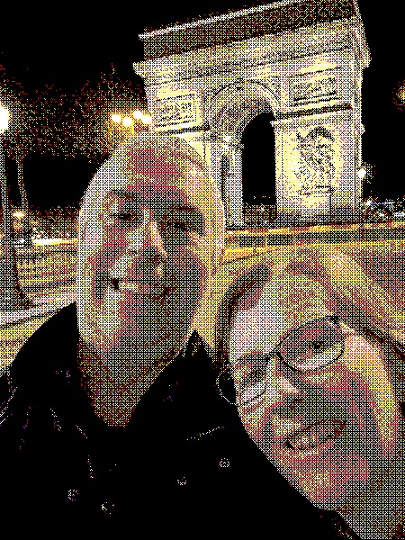
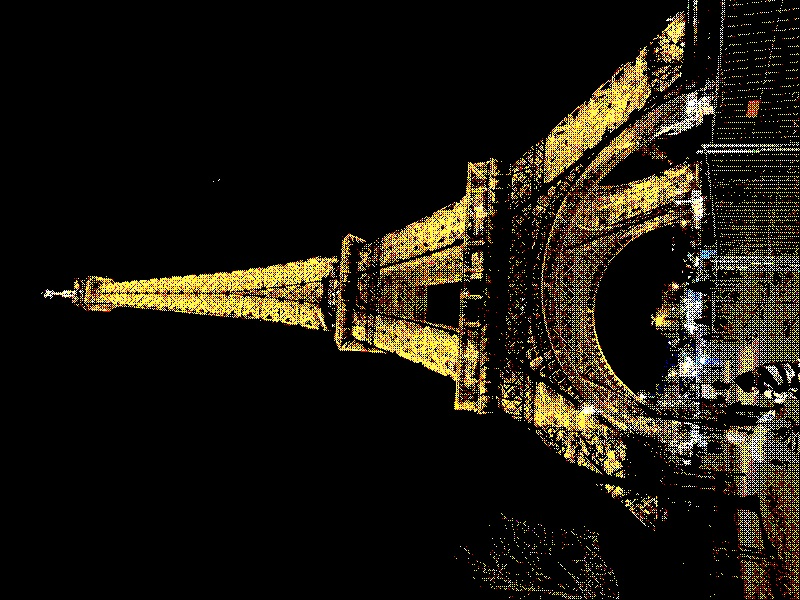
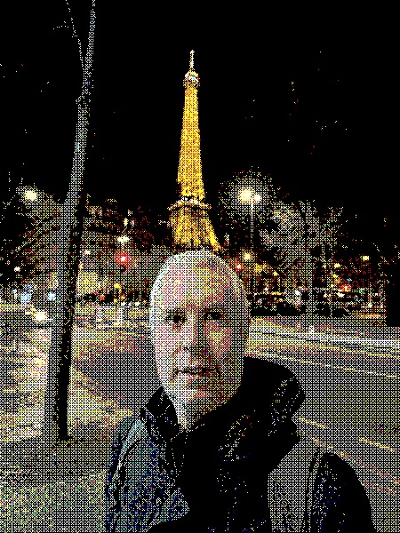
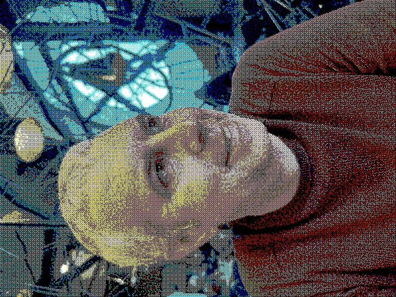

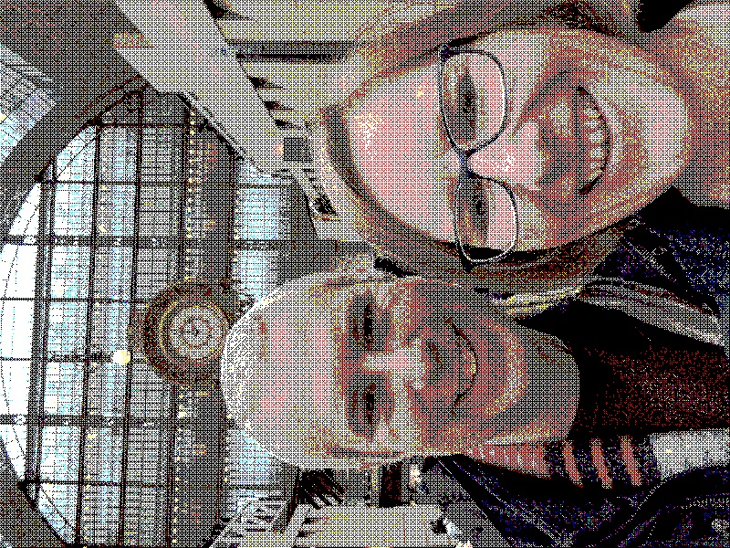