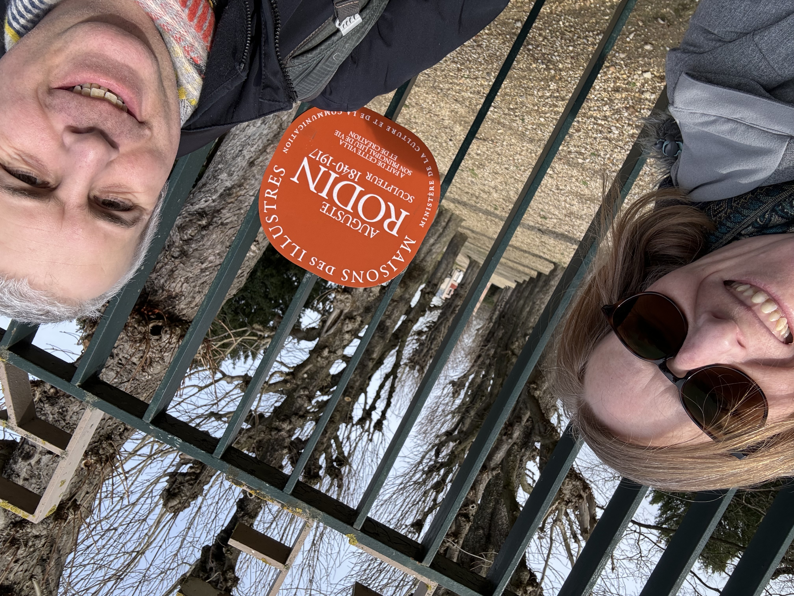
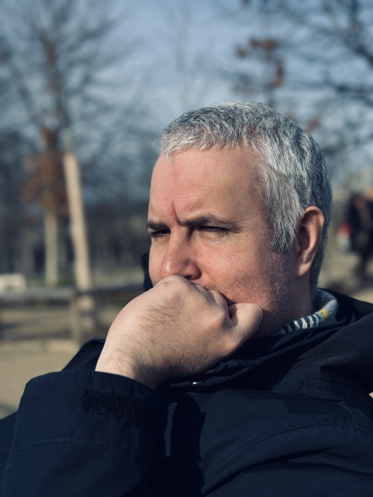
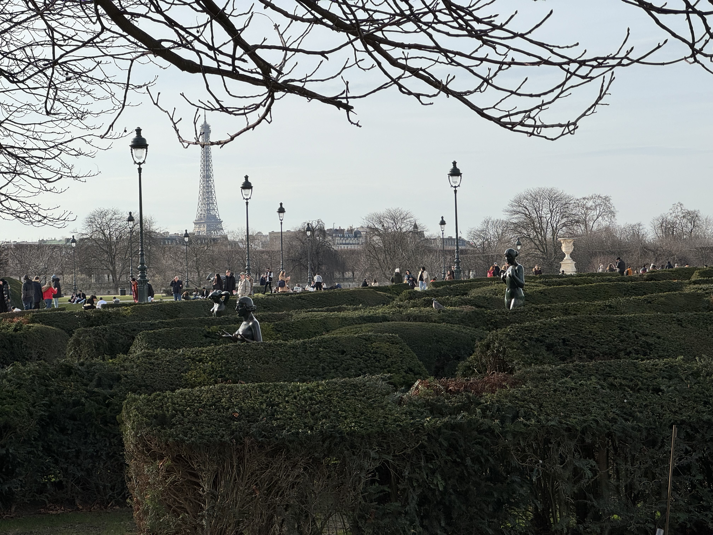
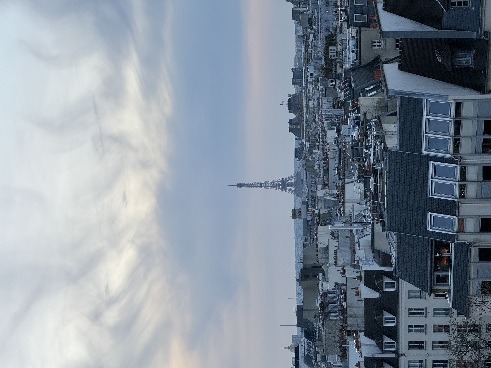
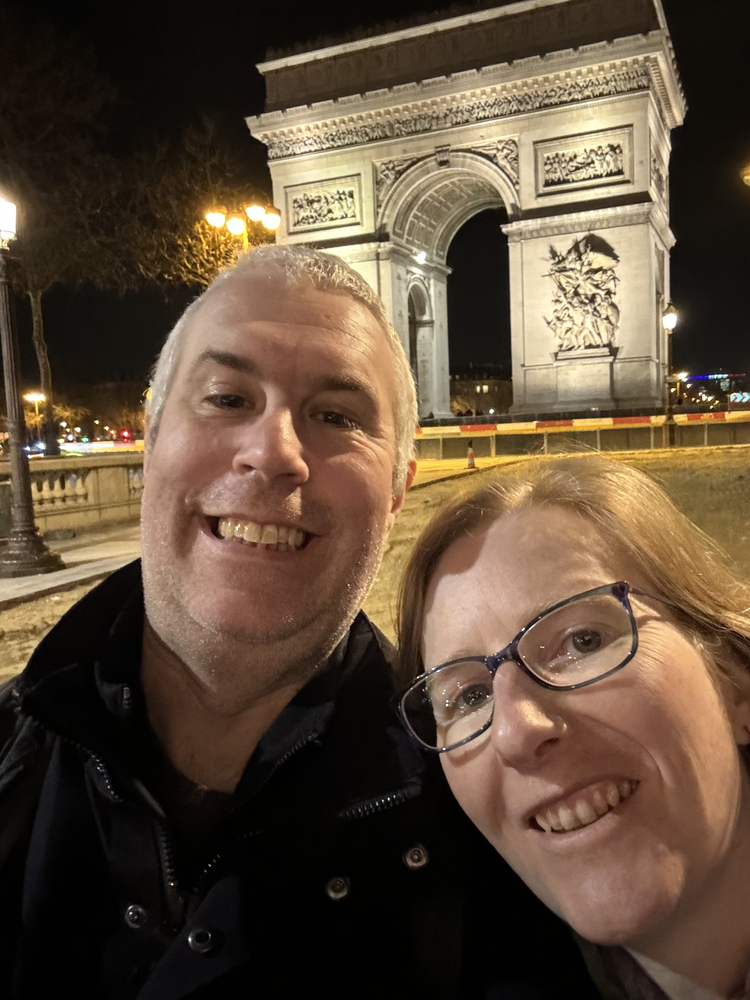
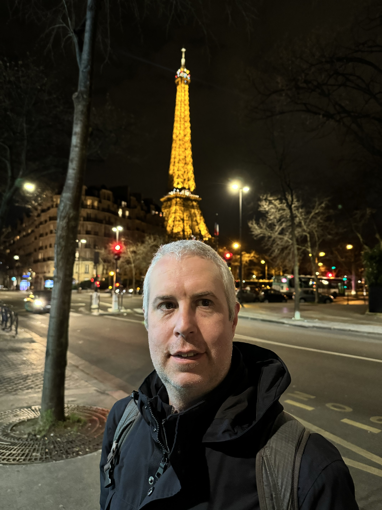
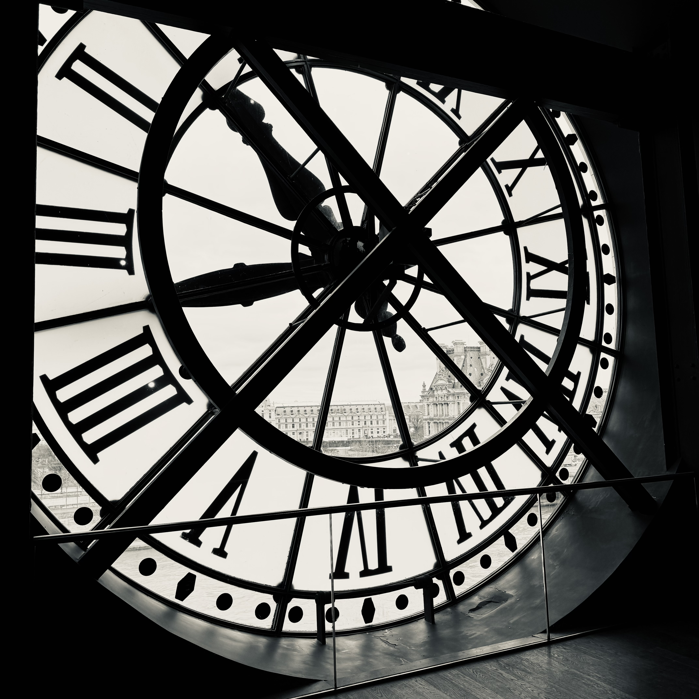
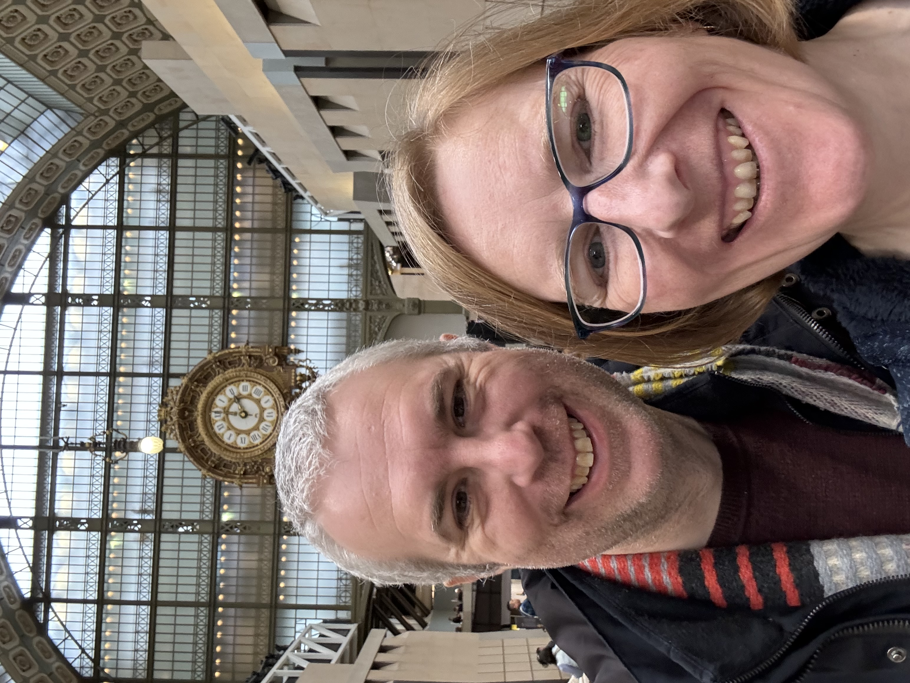

This time last year, Ingrid and I were on the Eurostar to Paris for four days. We did so much in our time there that I couldn't write about it at the time. Here's a little summary with a few photos.

Our chief aim was to take in as much Rodin as possible (as he's Ingrid's favourite sculptor) so on the Saturday we set out for Montparnasse and struck out for Meudon, where his house is. And... it was closed for winter!

So we had no choice but to walk back to central Paris (well we took the Metro for some of it). We naturally ended up down by Notre Dame. At this point, it was nearly finished. It was still possible to see what a staggering feat of engineering the restoration is.

Later we did the very Parisian of thing of going shopping. I found myself drawn to this one for some reason. You can see I am carrying a bag: this contains Ingrid's birthday present!

The next day, we went to the Musee Rodin - here's "The Thinker" in the gorgeous winter sunshine. I've put some another picture from this visit up [in the photos section](/photos/paris-0/) already.

The next morning we went for a walk in the Jardins de Luxembourg, and well everywhere really. I love this picture of Ingrid on one of the many beautiful bridges over the Seine. I should have made it all dramatic and black and white!

And also this picture of me relaxing with a coffee in the sunshine in the Jardin des Tulleries later on in the same walk.

We also walked past the Louvre and I couldn't fail to notice this arrangement of statues, lampposts, people, and the distant Eiffel Tower...

Talking of distant Eiffel Towers... this was the view from the Pompidou Centre. A really good collection of art inside. Lots of Kandinsky who I've given much attention too, but when you get to see at least eight of his best works in quick succession, it has a powerful effect.

Of course, all the famous Parisian landmarks couldn't keep their distance from us for long. We took a trip along the Metro from the Pompidou to check the Arc de Triomphe from a distance. We literally did this selfie and went back down the escalator!

The reason was that we were heading out to a gluten free Italian restaurant for dinner. I had a very nice pizza and Ingrid had Canneloni. Outside afterwards, it was clear that another famous landmark, hitherto distant, had crept up a little closer. (One of Ingrid's hobbies is taking pictures of me with landmarks coming out of my head, but you don't need to see them all...)

So at any rate, we decided to get a little bit closer because she was all lit up and beautiful. Not to mention the fact that she got all lit up and twinkly every fifteen minutes or so. (The tower, not Ingrid.) It's funny how it looks so beautiful, despite being made of iron and man-made.

The next day, we went to the Musee D'Orsay. A beautiful old train station dedicated as an art and sculpture museum. And furniture too. I quite enjoyed the furniture. And the cafe, which is where I am sat in the next picture.

Here's Ingrid's arty black and white picture looking out of the clock tower over the river. Some of that background is in her arty fashion shot from a few pictures earlier!

And here's a selfie of us under the great old station canopy. If I look knackered, it's because I was. We did so much that it was a very tiring trip. Nevertheless, we were still planning for the next time that we would go back!

