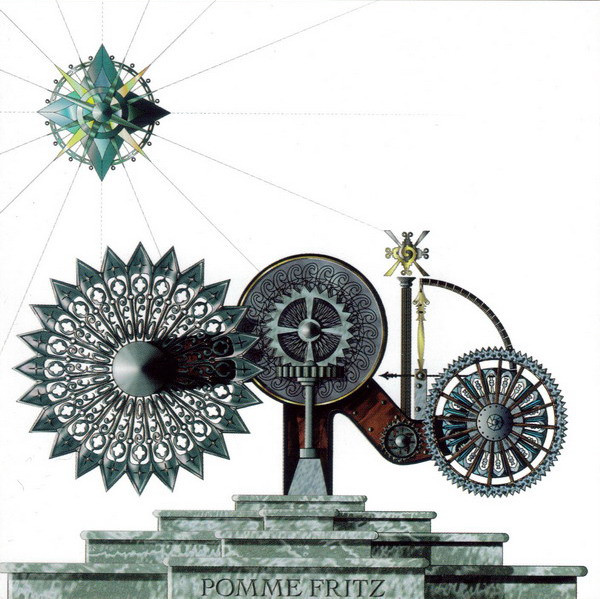

The release of Pomme Fritz by The Orb in 1994 was a moment of genuine excitement for me as it was the first new material they released after I'd become aware of them. Not only that, but thanks to my hard work riding around Emsworth on my BMX at unsafe speeds belting out Green Day's Dookie as out-of-tune-ly as is humanly possible, I'd managed to secure the funds to buy the album for myself. My excitement had been mounting from the moment the promotional postcard arrived a few weeks beforehand. I took my £4.99 to Our Price in Portsmouth Cascades on Saturday afternoon and bought myself a copy.

And boy, I pretty much hated it. <!--more-->The first track was great, but the next two tracks: "More Gills, Less Fishcakes" and "We're Pastie to be Grill You" were - to my adventurous teenage ears - noisy codswallop! It took _years_ for me to discern the subtle beats and rhythms underneath all the aggressively echo-boxed vocal samples, and even then it hardly seemed worth it. Those tracks must have sounded like panic attacks or paranoid delusions to listeners who had experienced such things, but I had no experience at that time to pin this waffle to.

Later, as I began to explore bands like CAN and Neu! I started to hear other pieces that helped me understand those tracks. The Orb's next album "Orbus Terrarum" (surely due a glorious vinyl reissue for its 30th anniversary *this* year?!) also helped me make sense of it - particularly the noisier digressions like "Montagne D'Or" and "Occidental". Fifteen years later when Pomme Fritz was reissued, the liner notes sheepishly referred to the 'album' as an extended single, and that the noisier tracks were more like the more radical remixes you might find on a single (like the lovely mix of "Oxbow Lakes" by A Guy Called Gerald). Tellingly, the bonus disc of remixes sounded a lot more like the chilled out parts of the original album. All that noisy trauma, wiped away, along with most of its personality.

I always enjoy Pomme Fritz now. I've always loved the cover. I like watching people's reactions to tracks 2 and 3: I may have hated them at first but I still memorised them and committed all their weird twists and turns to heart. It reminds me that you need grit to make a pearl, and that sometimes you have to work hard to find the beauty in art. Of course, it was just a load of stoners burning major label cash on a drug-fuelled vanity project, but it was definitely pastie to be grill you, the listeners near and far.