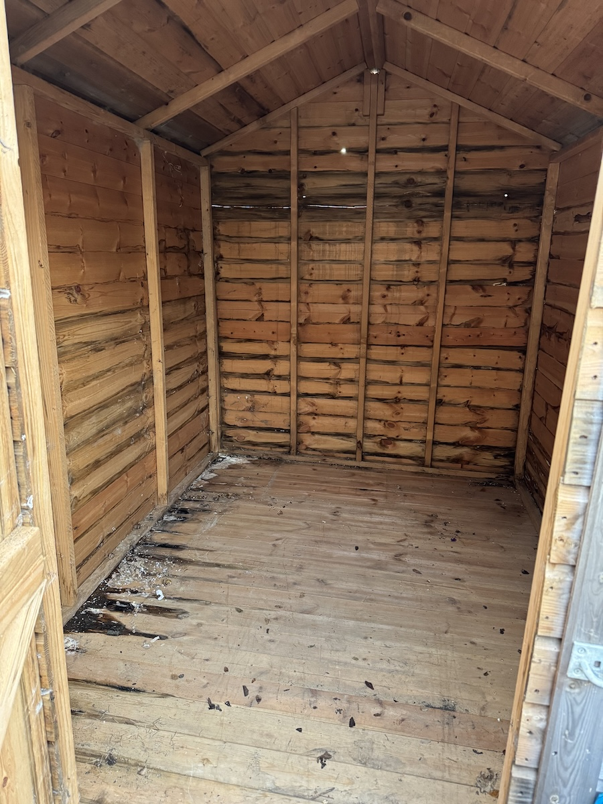

Yesterday I pulled everything out of our shed and we took the stuff we didn't need down to the dump. No one likes going to the dump, but it was strangely cathartic. It's due in part to letting go of things from the past, but also the fact that I haven't felt up to much lately. It ended up being a sunny afternoon so it was a pleasant walk back after we dropped off the hire car.

<!--more-->

The shed's being removed as part of the garden revamp. It's going to be replaced with a smaller shed that I intend to put less stuff into. We'll see how that goes. (Especially as Ingrid probably has other ideas!)

Most of the really old stuff was boxes from when we moved in. They had to be thrown out because something (hopefully mice, maybe rats?) had given them a good gnawing. It made me reflect on how I'd moved from place to place for ages and so in a way I was bit unprepared to live here for the length of time that I have. I used to prize being able to pack up and leave, but now it's a different story.

The garden revamp edges closer. There will inevitably be pictures of progress before, during, and after!

