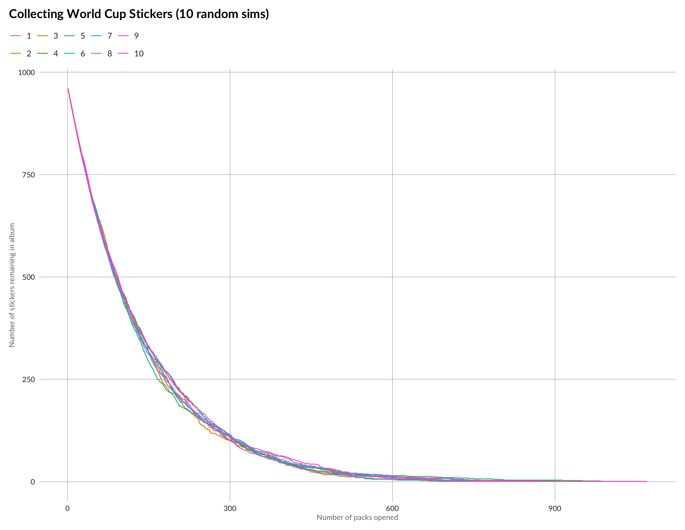
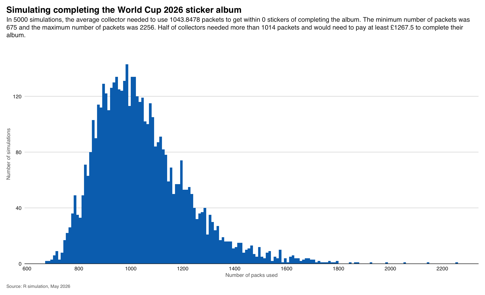
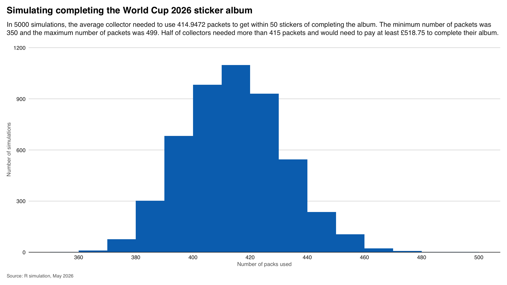
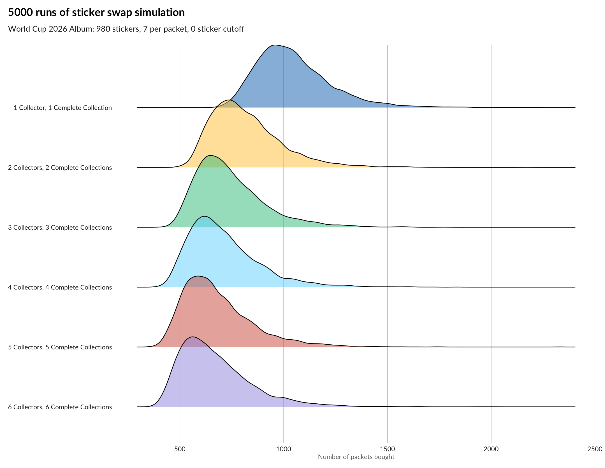
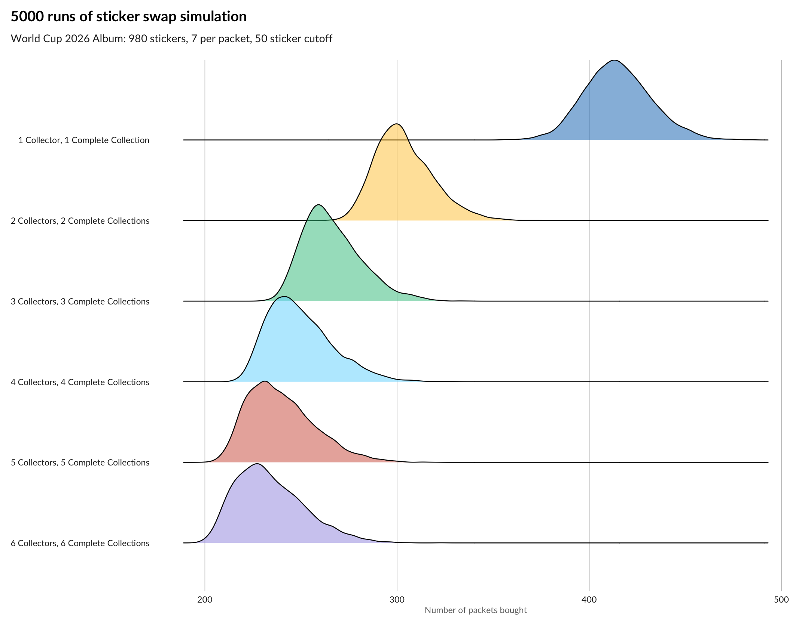
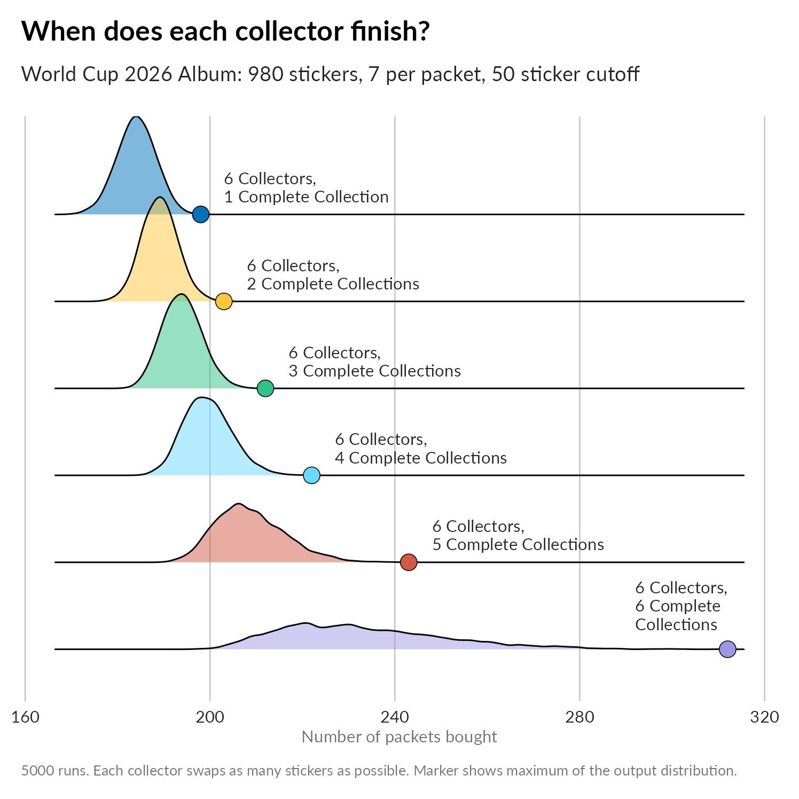
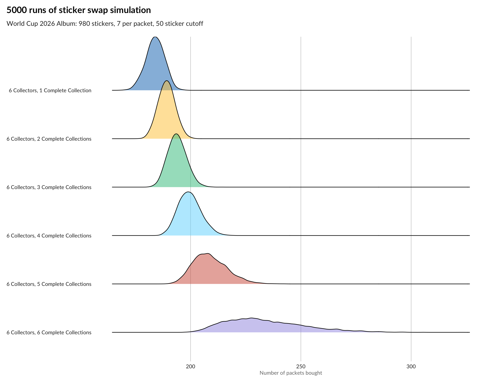

Ten years ago, ahead of the 2016 European Championship, I wrote a few posts about the Panini sticker album for the tournament and my efforts to fill it up. It was a nice subject to investigate with Excel and R as a little data science exercise. This post is a little update.

<!--more-->

### Previous posts

+ In [**Euro 2016 Panini Stickers**](), I wrote a bit about the setup of things (updated below) and showed off how you can use the Hypergeometric distribution to work out how many stickers you are going to be able to put into your album when you open a packet.
+ Of course it's fairly obvious that you fill the album quicker if you have friends to swap stickers with. There was no maths or stats content in [**Swaptastic Part 1**](), just some pictures of envelopes I'd received in the mail with stickers in.
+ In [**Part 2**](), I went into some more detail about a model I'd made for evaluating the impact of having peers to swap with. It was a rather brute force R model, but it showed that you can significantly reduce the number of packets you have to buy if you have about four or five people to swap with.
+ For [**Part 3**](), I built a Shiny app that lets you see the results of the swapping model interactively. It's hosted on the [Shiny Apps website](https://www.shinyapps.io) and I'm pleased to say that it still works ten years later!

### What has changed since 2016

+ EURO16 was 24 teams, WC26 is double that at a staggering 48 teams. Having boggled at the thought of seeing Iceland at an international tournament, we now get to see Curacao! Maybe they will beat England too!
+ Fortunately (or not, depending on your avidness), there are not double the stickers to collect. There's quite a few pictures in the album that would have been stickers in previous editions, and the number of stickers per team has been reduced from 28 to 20. The album has gone from 680 stickers in total to 980.
+ This time there are 12 additional stickers that you can collect from the labels of Coca-cola bottles in a promotional tie-in. These go in the back of the album, but I'm not interested in these from a collecting or analysis point of view.
+ Panini also say that there are some super-rare variations in stickers that occur at a rate of once in every hundred packets. These are always an extra sticker though (packs containing them have 8 stickers), so again they don't affect the analysis.
+ To accomodate the extra size of the collection, packs now contain 7 stickers (as opposed to 5 back in 2016).
+ Packs cost £1.25 now, a 250% increase on the 50p per pack 10 years ago.

### The Basics

In the highly improbable situation where you are able to get no duplicates at all, you need about **140 packets** (you need 974 stickers in all as you get six inside the album to start with), which will set you back £175. However, the whole point of these posts is that this simply doesn't happen! 

The first question we might ask is whether we generate swaps faster or slower now that both the album and the sticker packs are bigger?

Previously, I created this table: 

| **Number of unseen stickers (Out of 5)** | **With 600 stickers still to collect** | **With 300 stickers still to collect** | **With 50 stickers still to collect** |
|:--|------:|------:|------:|
| 5 | 53.4% |  1.6% |  0%   |
| 4 | 35.8% | 10.5% |  0%   |
| 3 |  9.5% | 26.9% |  0.3% |
| 2 |  1.2% | 34.1% |  4.3% |
| 1 |  0.1% | 21.5% | 27.2% |
| 0 |  0%   |  5.4% | 68.2% |

So let's make something similar for the new setup:

| **Number of unseen stickers (Out of 7)** | **With 900 stickers still to collect** | **With 600 stickers still to collect** | **With 300 stickers still to collect** | **With 50 stickers still to collect** |
|:--|------:|------:|------:|------:|
| 7 | 55.0% | 3.2%  | 0.02% |    0% |
| 6 | 34.4% | 14.2% |  0.4% |    0% |
| 5 |  9.1% | 27.2% |  2.7% |    0% |
| 4 |  1.3% | 28.8% | 10.2% |    0% |
| 3 |  0.1% | 18.2% | 23.3% |  0.4% |
| 2 |  0%   |  6.9% | 31.2% |  4.2% |
| 1 |  0%   |  1.4% | 23.9% | 26.2% |
| 0 |  0%   |  1.3% |  7.7% | 69.2% |

There's an extra column because there's way more stickers, and a few extra rows because the packs are larger. This time around, with 300 stickers to go you have an almost 1 in 3 chance of getting just one (or fewer!) stickers to actually put into your album.

### A Simple Model

Next, we can set up a simple model in R. (Last time, I actually did this in Excel but these days it's more faff.) Once you identify `stats::rhyper()` function as being the one you need, the main meat of the model is the following two-liner:


while(remaining > end_threshold){
  remaining = remaining - rhyper(1,remaining,album_size-remaining,packet_size)
  history <- append(history, remaining)
}


Each call to `rhyper()` generates a number between 0 and `packet_size` (in our case 7), based on how many stickers are remaining. That number gets deducted from the remaining number of stickers. I used an R list with the `append()` function to glue the current value of `remaining` to the existing `history` of values. The length of that list once the `while()` loop terminates ends up being the total number of packs you need in that simulation. Later on, I realised that I only need the interim values when plotting the individual paths. Everything else presented here just needs the length of the list, which is just as easily computed with a counter that increments during the `while()` loop.

Of course there's a fair bit of other code to set up the variables and data structures for holding the results. Most of this machinery was handled by R's built in `replicate()` function, which was fun to rediscover. The figures that appear in the rest of this post were generated with `ggplot`. 

First up, let's see how individual paths pan out. I ran 5000 simulations. There's no rationale for that number, it's a mixture of "it might enough" versus "because I can and still get the post finished". We can't really plot more than ten runs at once though, and even then it's hard to tell individuals apart. As always with these things, it's about looking at the ensemble and seeing what's happening within it:

And what's happening is that it takes lots of sticker packs to fill the album. Note that this chart is 10 randomly selected runs from my 5000, not the best or the worst. The last of these collectors finishes their album after opening almost 1200 packets: that's a big outlay, not to mention a very tall pile of unused stickers: about 7,420 of them which, if each sticker is about half a millimetre thick, would be almost 4 metres tall!

Let's make a histogram of all 5000 runs:

Exporting images from R with text that you can actually read is something that I consistently fail at, so here's that subtitle text again: In 5000 simulations, the average collector needed 1021 packs to complete their album. The minimum number of packs was 655 and **the maximum number of packs was 1989**. In half of the simulations at least 990 packs were needed, meaning that collectors needed to spend a total of £1237.50 on completing their album.

If that wording about "within 0 stickers" seems odd to you, then maybe you didn't spot the `end_threshold` variable earlier! In 2016 you were able to buy up to 50 specific stickers from Panini, in order to complete the collection. Assuming that it's the same deal in 2026, this alters the complexion of that histogram:

This time, across the 5000 simulations, the average collector needs 404 packs to get within 50 stickers of completing the album. The minimum number of packs needed was 347 and the maximum was 481. Half of collectors needed more than 403 packets, paying at least £503.75 to complete their album. You still need to pay for the final 50 stickers, but this is a lot cheaper than buying them all by yourself. I'm not sure what Panini would charge you for the 50 stickers - but it's not going to be £700!

Of course, there's another way, and that's where swapping comes into the picture.

### Got Got Need: A Sticker-swapping model

The good news about running a swapping simulation is that you can head straight here without knowing anything about the [hypergeometric distribution](https://en.wikipedia.org/wiki/Hypergeometric_distribution). You can use the sample function in R and build collections up in arrays for each collector. The bad news is that you need to come up with a mechanism for the swapping, and that involves every collector comparing their albums at every step.

My approach is to have collectors meeting after each round of opening a new pack to exchange any mutual swaps. Each collector receives what the other can offer and vice versa. My collectors are ordered, so there's probably some bias towards the first collector (they might take from the second collector what the third collector needs etc). The code already runs quite slowly for 5 or more collectors without adding randomisation of the collector order. Perhaps you could permute the rows of the collector array every K rounds, with K larger for more demanding runs.

I got Claude to convert the original R code for the swapping loop into a C++ version in order to use the RCpp package. This felt a lot faster than the original and it was something I've been meaning to learn for a while, so I enjoyed that. Of course, I just parlayed all this extra speed into what scientists are calling a "shit ton" of runs, because why not wait 4 hours for smoother plots.

#### Effect of adding friends to swap with

I grouped all my runs together for all scenarios of collectors and completed albums. This was pretty easy using the tidyverse function `expand_grid` (or `expand.grid` in base R). This does produce scenarios where there are more completed collections than collectors, which would obviously never finish, but they are easy to filter out. Sometimes instead of working out how to produce exactly what you need, just produce more than you need and trim it back. 

So first up, we have an increasing number of collectors, and we look at how many pack-buying rounds the group of collectors needs in order to complete the whole album (i.e. my cutoff value is back down to 0). In every group, every collector finishes their collection. The blue curve is a slower running version (in R) of the process I described earlier - a naively implemented single collector filling a whole album. The peak of the distribution is just below 1000 packs total, though the tail stretches off to the right just like our first histogram did. It's sometimes hard to spot where the tails of ridge plots end, so I've also plotted the maximum of the distribution as a big dot. 

Once we jump to two collectors, the peak of the distribution shifts left: each collector needs to open 750 packs for both collectors to complete their albums. Note that this is 1500 total packs bought by both collectors. Two collectors working independently could end up buying more than this each! Again the right hand side of the distribution has that slow tapering tail imposed by the second collector completing their album: they're on their own at this point because we've insisted that all swaps must be mutal.

Beyond two collectors we see the same phenomenon: a left-shift of the peak and a long tapering tail to the right. As the number of collectors increases though, the tail of the distribution should get shorter. Why? Because that last lone collector responsible for the tail gets to swap stickers for longer.

Next, we can look at the situation when the cutoff is increased to 50 stickers. Here each collector swaps until they have fifty stickers to go. I must admit I don't track what happens to collectors who reach the cutoff that are able to swap if one of the remaining collectors finds a sticker they need: I think the swap occurs, so some collectors might not need to buy 50 more stickers at the end of the process.

Nevertheless, the picture is similar for this scenario (the x axis isn't though!): 

Again, going from one collector to two reduces the number of rounds by about 25%, and as you might expect, the returns of adding more collectors is also greater. Each collector has 50 more exit routes from collecting, but so does that final collector!

#### How long does it take each collector to complete their collection in the swapping scenario?

Finally, these two plots show the experiences of each collector in a sequences of six collectors. (Note that these are not from the same runs, they are separate runs with 6 collectors collecting until J collections are complete with J running from 1 to 6.). The figures mostly illustrate the variance in experience for the later collectors in the group.

First completing the whole album:

Next, completing up to the 50 sticker cutoff:

#### Other ways of swapping

Another possible way to model swapping is to use a pool. All collectors discard their duplicate stickers into a pool from which the other collectors can draw as many stickers as they still need. For fairness, and because order matters, we could say that collectors visit the pool in an order determined by how many stickers they contribute to the pool. In four years time, in 2030, it will be the last time Panini ever makes a World Cup sticker album, so perhaps I will look into then!

### Conclusions

+ **Swap with friends!** If you have about six friends you can swap with, you can cut the number of packs you each have to buy in half.
+ Aim to **collect up to a cutoff and buy your last stickers directly**. You were hoping to find the shiny of the Cabo Verde badge in a pack? You still will, just in a nice envelope from Italy. (Seriously, Panini's envelopes are/were great, I still have mine from 2016.)
+ **Use the RCpp package** and C++ to speed up your R code if you have lots of loops going on. I've been aware of this for generative art applications for a while and it was nice to try it out on some familiar code. It was easier than I expected.
+ **Ridge plots are pretty**. There will be another post about how I gussied them up for this post. It involved some literal cut and paste!