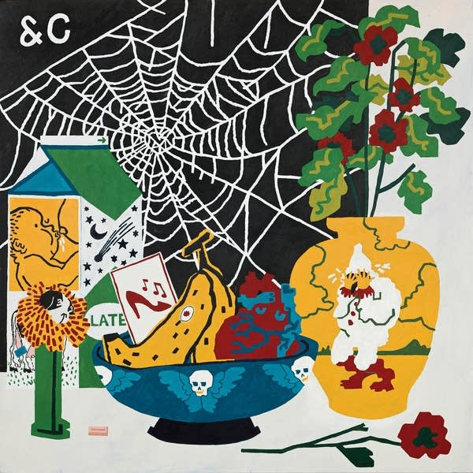

Getting back to my occasional album revisits, I'd like to consider the 2021 Parquet Courts album "Sympathy For Life". This is partly because I own it on vinyl and put it on the other day while I was doing some rather humdrum data downloading at work. It's that kind of album, quite loose and jam-based.

<!--more-->

Recorded just before lockdown, first in New York then at the Real World studios in Box, the album seems eerily prescient of what was to come later in the Covid pandemic. These are songs about constantly being watched by AI and the sort of coddling of the modern mind that results from this. It's not quite as good as the previous album "Wide Awake" but is probably better than "Human Performance". It's so relaxed and different to the previous album that you might have expected it to appear under their Parkay Quarts alias.

The first track is "Walking at a downtown pace" and is very much a song about getting back out into the world in order to hang out with your people. I think we've all had those moments in the past few years or so where we've gone "oh I haven't done this since before the pandemic, it's really nice to be doing this again!". This song, despite being written and recorded beforehand, seems a pretty good soundtrack for those moments.

Likewise "Black Widow Spider" which also rocks out a bit, with its tale of wanting to be somebody else. It's dark and sinister, and also has a wonderful bass line: the kind of you sing along to as part of the chorus "doop doop de doop _black widow spider_". And then after that everything goes very loose and funky! There's "Marathon of Anger" which seems to be about the importance of gig workers unionising, but is obviously a far more enjoyable song than is implied by that description. There's also "Just Shadows" which seems like a stream of consciousness all cut up, like "Marathon of Anger" it's quite hypnotic and ends with the lines "Preferences set, authorising / Life is not as modern as it seems / Can't pick who you love". Not only is the modern world feudal in its control over what you can say or do, but also your potential matches and mates are chosen for you by an algorithm.

Meanwhile "Plant Life" which follows is a song that sounds like its own remix, a jam session extended out into a groove and improvised over. There's a spoken word part that isn't included in the lyric sheet and the whole rolls on for ages closing out side one. This song was released as a single with two remixes that somehow manage to sound more orthodox than the original!

Over on side two "Application / Apparatus" goes over similar ground to "Just Shadows" only deeper into the groove: "Application, soothing like a mother's voice... ... conversation difficult with anyone". The lyrics cover the convenience of driving around being navigated by a talking GPS while reflecting the origins of the technology as a weapon of war (as is the case with so much technology).

"Homo Sapien" is the last rowdy track on the album and celebrates how 'far' we have come as a species: "What a time to be alive / a tv set into the fridge / a voice that recites the news / and leaves out the gloomy bits". But also how the same technology that improves our lives has us acting in a Pavlovian manner: "Jump like begging dogs / standing straight up and down / speaking intelligently". It's very much a classic noisy Parquet Courts song, which is presumably why it was another of the singles.

The next two tracks, the title track and "Zoom Out" continue the theme and have a similar groove-based construction to many of the other tracks. They tend to pass me by on most listens. The album then closes with two sad ballads - again quite akin to similar songs on previous albums - "Trullo" and "Pulcinella". I think both these songs are named after classical clowns but I might be wrong. The latter certainly has some melancholy and weird lines: '"Darling it's me," as the mask comes off / "It always was."'

I really like this album, though unlike other Parquet Courts albums it feels more like a whole entity in and of itself. The songs all have similar themes and are constructed in similar ways. Perhaps the decision was made to release what was 'in the can' in 2021 rather than going back into the studio after Covid to write new songs. I'm hoping that they release more music soon, it seems like the world needs them now more than ever.
