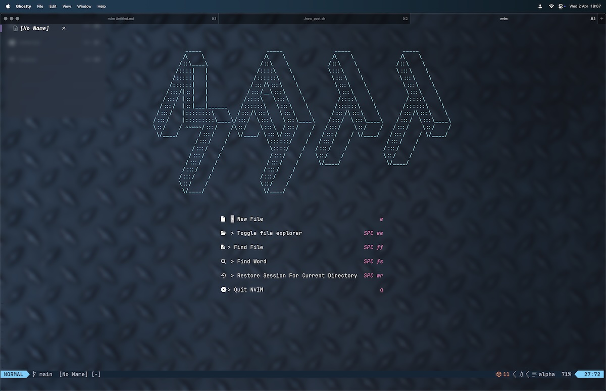

I've been trying to settle on a text editor, IDE, and terminal for a long time now. Partly I'm limited by what I can use at work because I owe to myself and my colleagues to be able to reproduce all my skills in a work setting. However, part of me has also wandered off a bit after reading about the idea of a "personal Development Environment" (or PDE I guess, though in a former life that [meant something very different](https://en.wikipedia.org/wiki/Partial_differential_equation)), which is essentially an application where you can do anything and have it configured exactly how you like. Here's an update on my progress on that front:

<!--more-->

I'm currently using Neovim with a configuration I downloaded off GitHub that I've gradually hacked into shape. I'm much more often a writer than a programmer, so I've had to shape the config back towards the business of writing and writing markdown specifically. That's involved some shenanigans with wrapping because you obviously want hard wrapped lines if you're writing in an awful language like JavaScript with all its nesting. I would say about half my config fiddling has been to get markdown files to wrap the way that I want them too.

So far so dull, but at the same time I have also started to learn an appreciable number of vim text motions and this has had a good effect on my writing. That, coupled with [getting Chat-GPT to help me write a script that sets up a new blog post](https://mattischrome.com/posts/fun-with-chatgpt/), has helped me to write a bit more. Also, look at how I've managed to set up my homescreen: it's amazing what you can do with ASCII generators from the web!

I also use Obsidian to make notes now but can access and create them in Neovim. This is really cool. My Obsidian vault is on iCloud, so I can edit these notes on my phone when I'm on the go and still use Neovim when I want to do some serious typing. I've also configured some keyboard shortcuts for the Neovim Obsidian plugin and it's quite fun to know that I've set those up each time I use them.

|-------------------|------------------------|
| Obsidian function | Matt's Neovim Shortcut |
|-------------------|------------------------|
| Open current file in Obsidian app | LDR o o o |
| Make a new Obsidian note | LDR o n o |
| Make a new Obsidian note from a template | LDR o n t |
| Open today's Obsidian daily note | LDR o d t |
|-------------------|------------------------|

In the above table "LDR" is the leader key, which for me is the spacebar.

I've also set up autocomplete with a custom function that produces behaviour like the intellisense function on Visual Studio Code. This is nice when you've been typing for a while as more words become available for you to TAB to completion. It's really nice when you are making notes because you start to type notes faster the longer your note starts to get!

The next step for me is to [get working with R, Python, and Quarto in Neovim](https://quarto.org/docs/get-started/hello/neovim.html). Then I'll be really happy I think. It would be nice to write R code in this environment and not be beholden to RStudio or VS Code, which can both feel a bit bloated and slow compared to this Neovim setup. Another advantage of Neovim is that it's also very portable, not just across computers but also across platforms. I'm looking forward to digging deeper!
