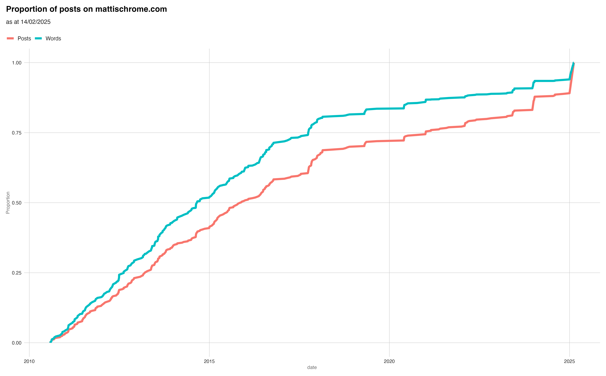

Here's of graph of how the number of posts and the total word count on mattischrome has evolved over the years:

<!--more-->

In order to make a comparison between words posted and posts, I had to normalise both so the posts line (red) is the proportion of all posts (404 before today) and the words line (blue) is the proportion of all words contributed by each post (334,031 before today).

You can see that the current streak from the start of 2025 has created a spike in posts (11% of all posts) but these have not been as wordy as those that have gone before. 2025's posts have only contributed 6% of all the words written on this blog.

Of course, this was meant to be a longer post but my investigations revealed that the metadate of my posts is a bit of a mess! I'm surprised that Hugo can even cope. So some of the time set aside for writing ended up being spent on fixing bugs and data engineering problems!

That said, you can definitely see the dates where I've rededicated myself to the blog over the years. There's the best albums of 2023 that add a spike towards the end of 2023 and start of 2024. Similarly, if you know to look for it, there's the period where I was sending intermittent updates from South America - that's the bit on the graph in 2014 where the proportion of posts rises slowly and the proportion of words rises slightly faster above it.

I'll keep playing with this data and I'll try to write a follow up post with some more charts before the data gets too stale. It's interesting to see how the blog has changed over the last fifteen years.
