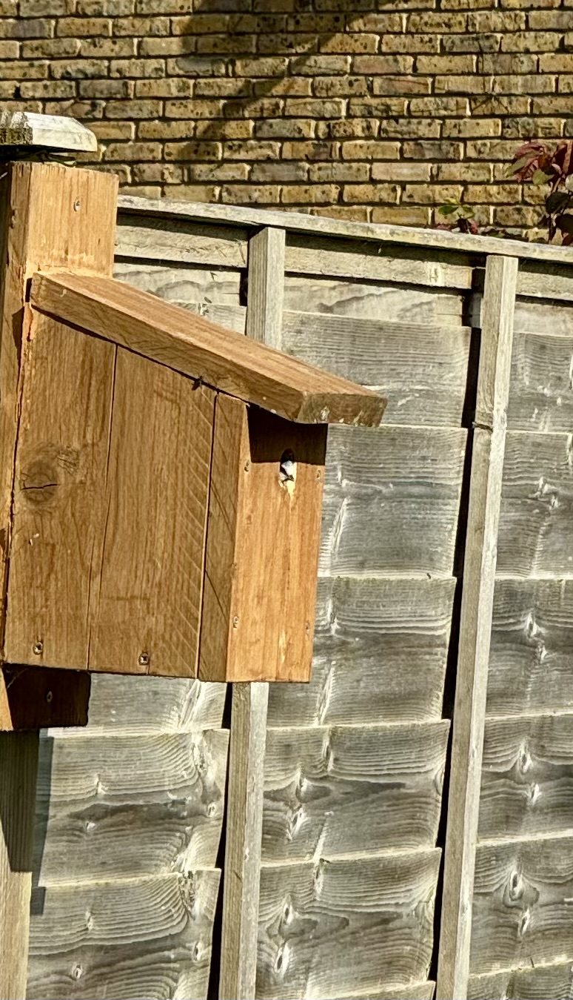
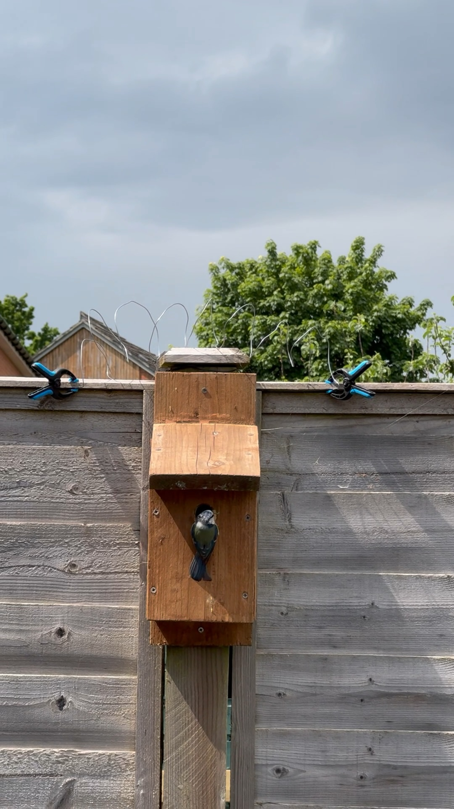
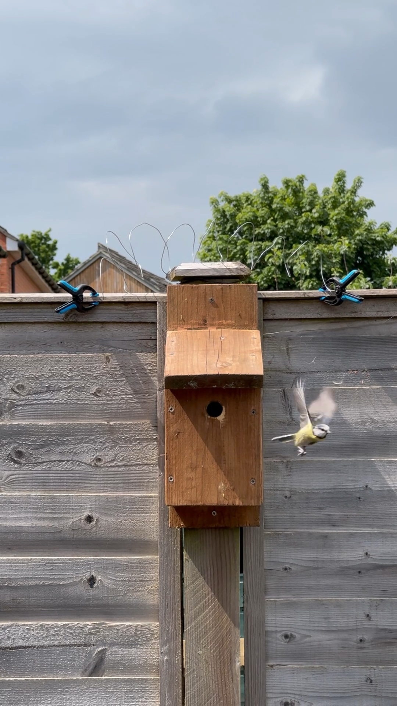
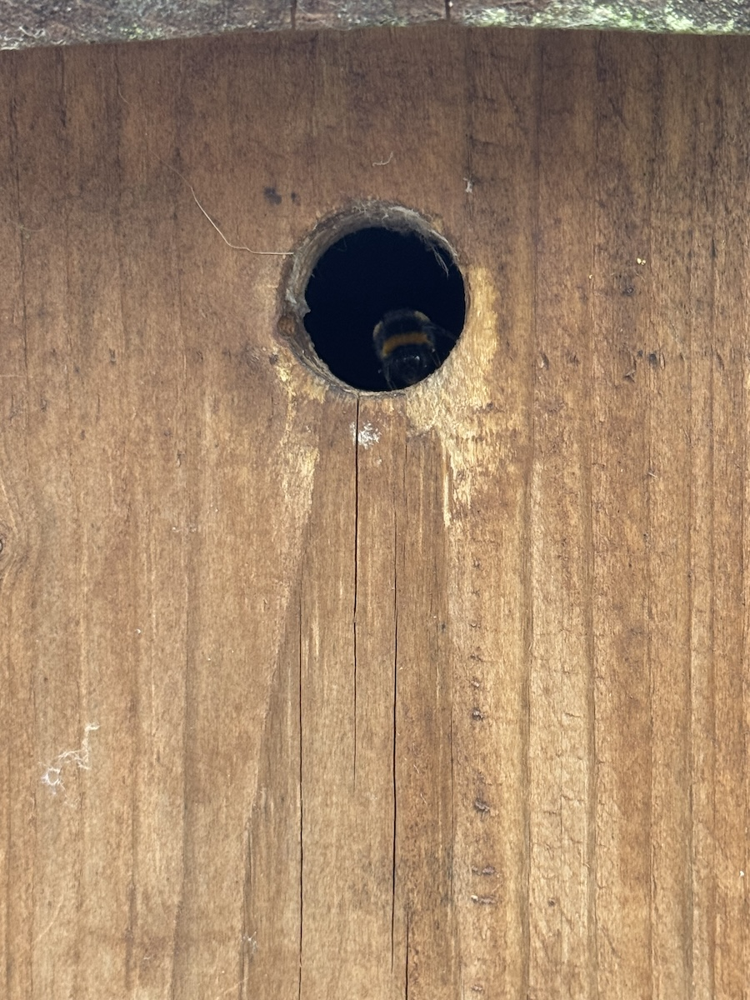
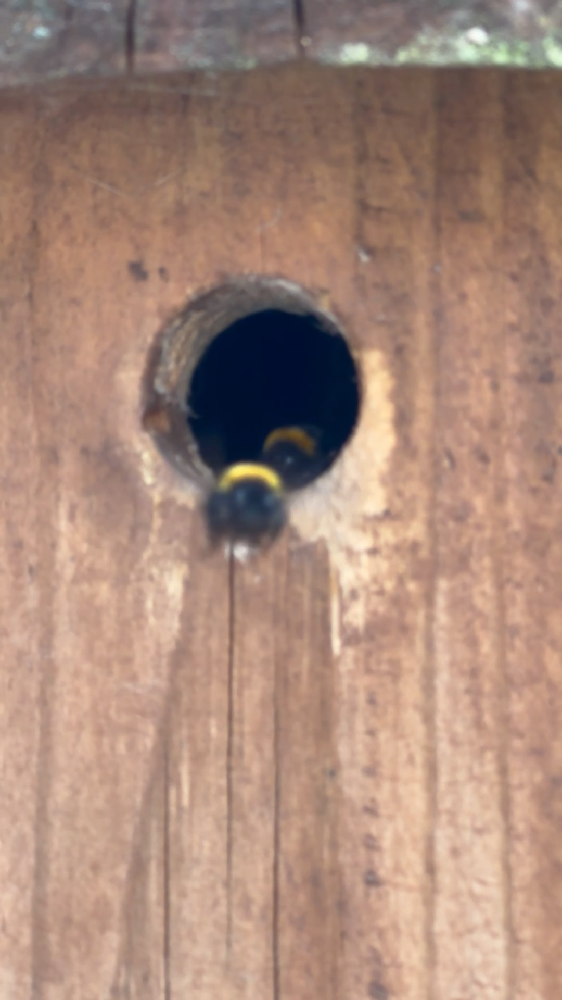

"I've never had one fail" says my Dad brandishing his drill on Boxing Day 2022, before heading out into the garden and putting up our Christmas gift, a handsome wooden bird box. "If I put it up, they'll come along eventually."

<!--more-->

The first year we watched and waited. A couple of blue tits sniffed around before moving on. To be fair, our garden was not that hospitable an environment. We'd put the black plastic down that autumn to kill off the grass and do our own little reset. Time eventually passed to the point where we weren't going to be doing it ourselves.

But early last year, I caught this glimpse of a blue tit looking out of the box. I was making a cup of tea and handily I had my phone in my pocket. I took this rather blurry snap and sent it to Dad. "Looking good", he pinged back almost instantly.

Over the next few weeks we saw definite signs of nest building activity. Blue Tit 1 and Blue Tit 2 fussing back and forth. (We thought there were two but I don't think we saw the two together until later.)

We began to take almost as much interest in the visits of neighbouring cats as our own cats did. One of them, a black cat with white legs whom we dubbed Socks, was an almost daily visitor. Ingrid, growing fearful that the unseen brood might become a tasty snack for Socks, fashioned a sort of attempt at a barbed wire cordon. Well, a wire one anyway.

It seemed to work. Socks began to avoid our garden. More likely from our shooing them off, rather than any effect of the wire.

One sunny day, Ingrid was able to shoot three minutes of video with both parents popping in and out of the bird box with wriggling caterpillars in their beaks.

Before flying away to find more. Obviously, no interventions were staged to save the poor caterpillars. Perhaps we didn't have thin enough wire. And we didn't know where they lived.

As time passed, we saw less and less of the blue tits. We looked out for fledglings learning to fly but saw none. The pressures of natural selection mean that doesn't take too long. Time passed: Spring, Summer, Autumn, all that. We have no idea whether the wire protection prevented Socks from getting a tasty snack.

Meanwhile, we decided to finally get the garden sorted. I fretted about getting the bird box down from the fence, thinking that the work would disturb any birds that decided to use the box this year. But because work began in February, it was probably too early for the nesting to start anyway. We left it up.

And so the bird box became a bee box. I accidently knocked when laying out the parts for our new shed. Cue a miffed blur of buzzing and a brown bee sauntering out and into the blue yonder.

Fortunately, they're bumble bees, and even if they weren't most garden bees are solitary critters. Most species tend to be pretty even-tempered and not a nuisance. They have an affable buzz and have got to work on visiting our new plants. It's for the garden to have signs of life again. It's a veritable hive of activity!

