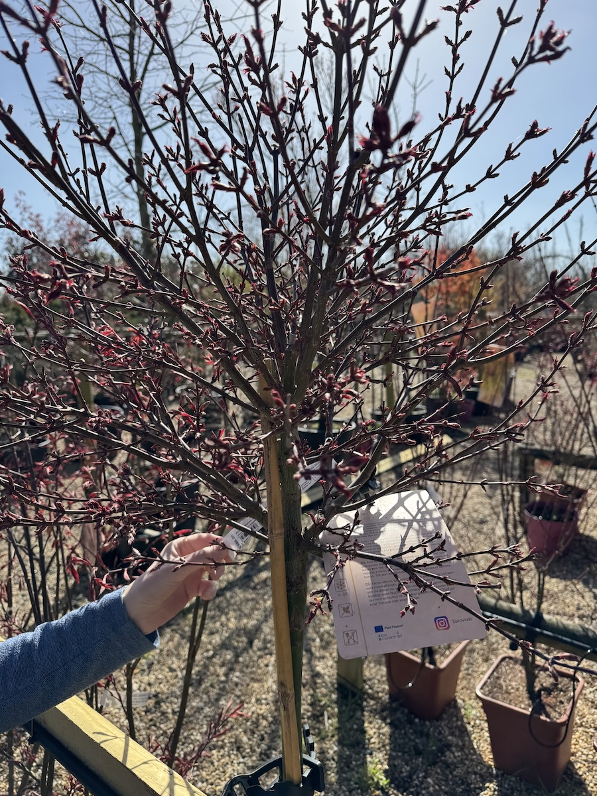
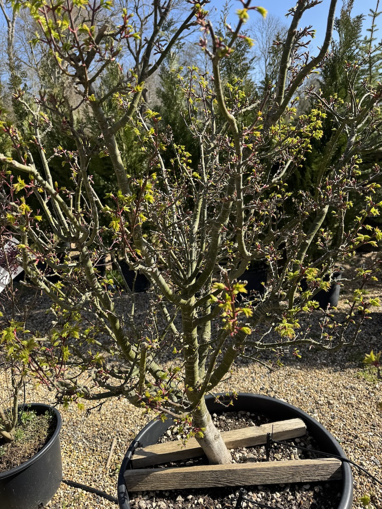
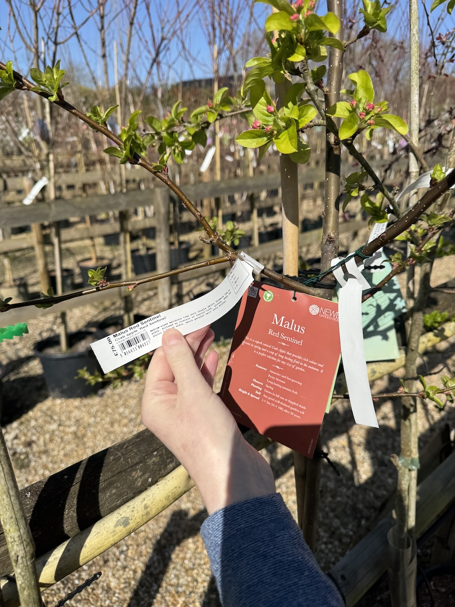
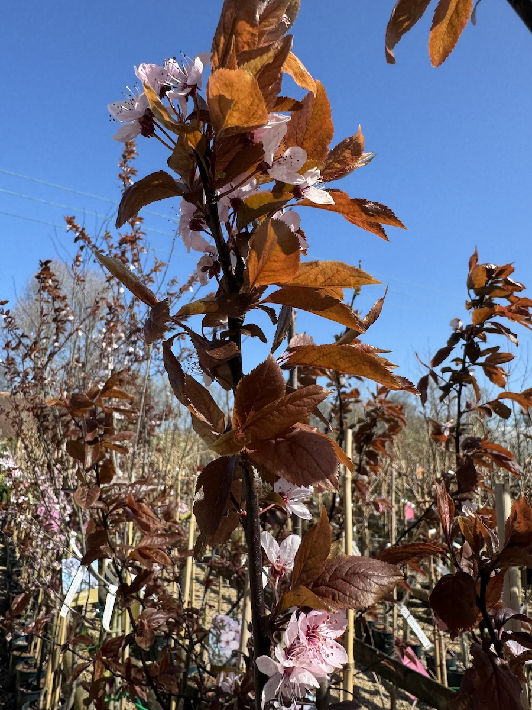
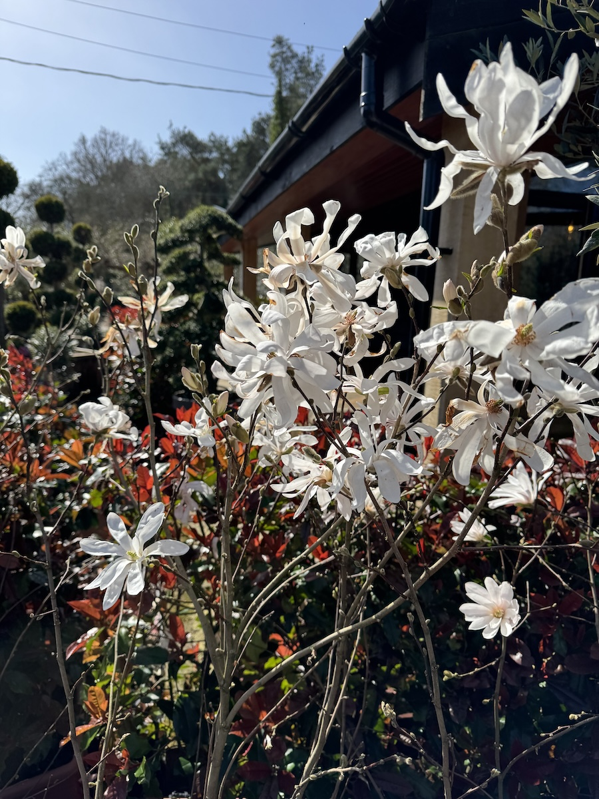
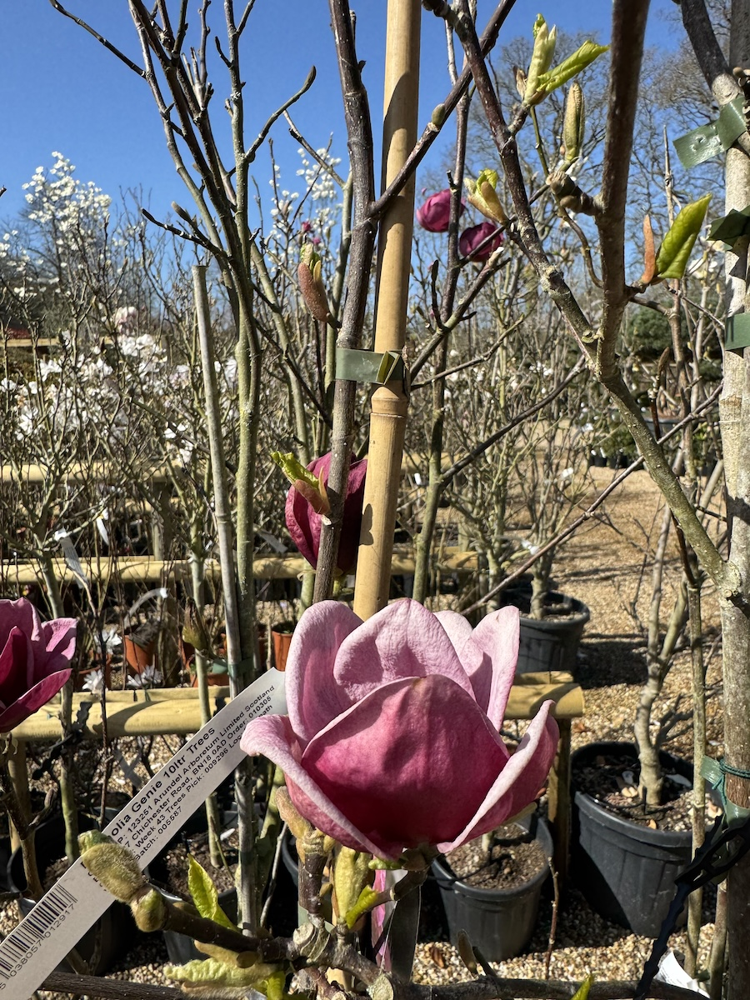

As part of getting the garden done, we've been out and about looking for trees. It's quite exciting seeing in person all the trees we've discussed with our garden designer. Here are some of the species we've been looking at:

<!--more-->

This is a Japanese Maple called Skeeter's Broom, certainly a memorable name and also a good-looking and memorable tree. I particularly like the redness of the leaves, though the colours can vary with the seasons. It's quite an expensive tree though, compared to others that we looked at.

Another Japanese Maple we saw was "crispifolium", which has green leaves at the moment.

Another one we like, which was more of a bush, was Japanese Holly but I didn't take a very good photo of that one. It has nice round leaves. I also quite like ordinary holly. If we got a Robin in the garden, we'd be set for Christmas cards for life!

A revelation was discovering that you can buy pomegranate trees! This is an ambition that I never knew I had, although I am not sure we can provide as sunny a spot in our garden as it had at the arboretum.

Fruit trees are a nice idea, quite good for the birds and such like. We've been told that a crab apple tree might be quite nice, though I'd need to have another look at them. This picture shows a variant known as red sentinal, and they have nice pink flowers in early spring:

Another fun sounding option, though the flowers weren't out was for a Euonymus called red cascade. This was in the area with all the cherry blossoms, which are out in force at the moment and look great. Especially this "black cherry" variant, I love the red/brown leaves against the pink blossoms:

The other option that was out in flower and looking stunning in the sunshine were the Magnolias. This version had spidery all white flowers and looked very arresting:

It was part of a very mature plant though that might prove to be too big for the spot we want our main tree to go in. The same is probably true of the "classic" Magnolia that provided this beautiful photo:

I didn't take any pictures of them because they aren't really in leaf yet but we are also considering a Rowan tree. It has bright orange berries and there are variants with some interesting leaf patterns.

I'll post another update when we go and look at more trees!
